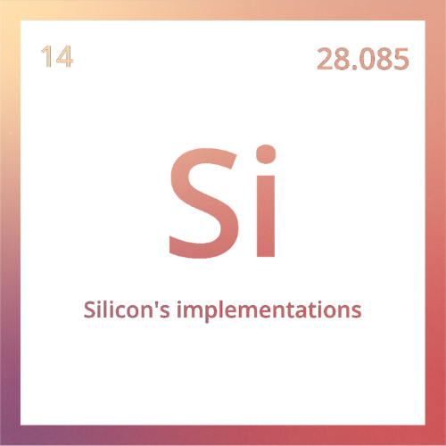

<h1 align="center">Silicon's implementations</h1>

  

<strong>Si</strong> is a collection of implementations of the STL.

 

**Si**, my own take on the standard template library, is a collection of tightly curated implementations, sprinkled with my own visions and ideas. It is designed to not be a direct replacement to the STL, rather an alternative to it. 
